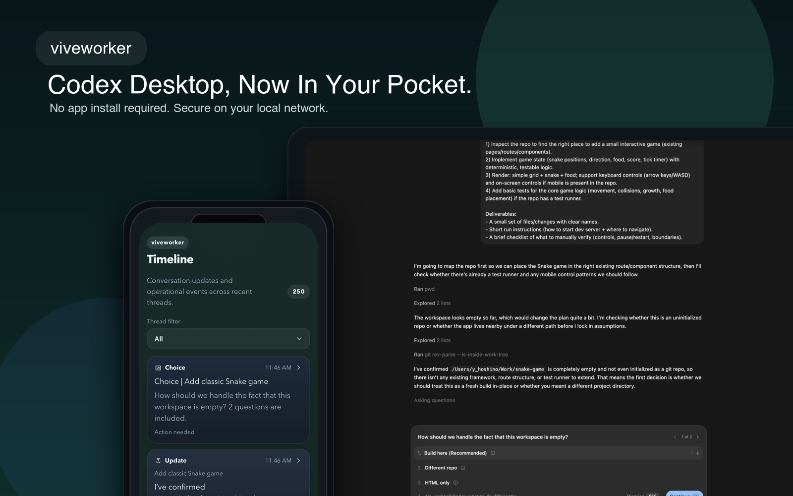

# viveworker

[](https://badge.fury.io/js/viveworker)
[](https://opensource.org/licenses/MIT)

`viveworker` brings Codex Desktop to your iPhone.

When Codex needs an approval, asks whether to implement a plan, wants you to choose from options, or finishes a task while you are away from your desk, `viveworker` keeps all of that within reach on your phone. Instead of breaking your rhythm, it helps you keep vivecoding going from anywhere in your home or office.

Think of it as a local companion for Codex on your Mac:
your Mac keeps building, and your iPhone keeps you in the loop.

## Why It Feels Good

With `viveworker`, you can:

- approve or reject actions the moment Codex asks
- respond to `Implement this plan?` without walking back to your desk
- answer multiple-choice questions quickly from your phone
- review completions and jump back into the latest thread
- get a Home Screen notification when Codex needs you

The point is simple:
keep Codex moving, keep context close, and keep your momentum.

## Best Fit

`viveworker` works best with:

- Mac + iPhone
- a trusted LAN or a remote access layer you control
- the Home Screen web app with Web Push enabled

It gets even more fun with a Mac mini.
Leave Codex running on a small always-on machine, and `viveworker` starts to feel like a local coding appliance: your Mac mini keeps building in the background while your iPhone handles approvals, plan checks, questions, and follow-up replies from anywhere in your home or office.

`viveworker` is designed for private use on your own network.
It is not intended for direct Internet exposure.

## Mac mini Ideas

`viveworker` pairs especially well with a Mac mini.

You can use it as:

- an always-on Codex station that stays running in the background
- a way to keep approvals and plan checks moving even when you are away from your desk
- a lightweight monitor for long-running coding or research tasks, where your iPhone only surfaces what needs your attention
- a small local AI appliance for your home or office
- a quick way to review a completion and send “do this next” back into the latest thread from your phone

## Quick Start

For the full experience, start here:

```bash
npx viveworker setup --install-mkcert
```

If `mkcert` is already installed and trusted on your Mac, plain setup is enough:

```bash
npx viveworker setup
```

By default, `viveworker` uses port `8810`.
If that port is already in use, choose another one:

```bash
npx viveworker setup --port 8820
```

To preconfigure the official Cloudflare Zero Trust overlay while keeping LAN use as the default:

```bash
CLOUDFLARE_API_TOKEN=... \
npx viveworker setup --install-mkcert \
  --access-mode cloudflare \
  --public-hostname app.example.com \
  --cloudflare-account-id <account-id> \
  --access-allow-emails you@example.com
```

To preconfigure the managed relay mode:

```bash
npm run relay
npx viveworker setup --install-mkcert --access-mode viveworker
```

`viveworker` mode expects a relay backend that can ultimately serve `https://[uuid].viveworker.com`.
This repo now includes that backend scaffold under [`services/relay/`](./services/relay), but a real public deployment still needs wildcard DNS and TLS in front of it.

## Recommended LAN Setup Path

`viveworker` enables Web Push by default. The recommended first-time flow is:

1. Run `npx viveworker setup --install-mkcert` on your Mac
2. If macOS asks, allow the local CA install
3. On your iPhone, open the printed `rootCA.pem` URL
4. Install the certificate profile and trust it in iPhone certificate trust settings
5. Open the printed pairing URL in Safari
6. Pair your iPhone with the code if needed
7. Add `viveworker` to your Home Screen
8. Open the Home Screen app
9. In `Settings`, tap `Enable Notifications`
10. Tap `Send Test Notification` to verify delivery

## Access Modes

`viveworker` now treats `ACCESS_MODE` as the full operating topology:

- `lan`
  Local-only setup for the same LAN. This is the default.
- `cloudflare`
  LAN-first setup with a Cloudflare Zero Trust overlay you can enable temporarily from the iPhone app.
- `viveworker`
  LAN-first setup with the managed relay flow and a fixed `https://[uuid].viveworker.com` remote URL.

All three modes keep the local LAN app as the main daily path.
Remote access is an overlay you turn on only when you need it.

## Cloudflare Mode

Cloudflare remote access is an overlay on top of the normal LAN setup.

The intended day-to-day flow is:

1. use the LAN/Home Screen app normally while you are home or at the office
2. before you leave, open `Settings > Remote Access` on your iPhone
3. enable external access for a temporary window
4. copy the printed external URL
5. when you are away, open that URL in Safari, pass Cloudflare Access, and continue from the same trusted device

Important details:

- LAN usage stays primary; the external URL is secondary and off by default
- the public URL is fixed, but `viveworker` only starts the local `cloudflared` tunnel while remote access is enabled
- remote access expires automatically after a limited window
- Cloudflare Access is the outer gate; `viveworker` pairing and trusted-device cookies are still required inside the app
- `viveworker` does not trust Cloudflare headers as app authentication

What `setup --access-mode cloudflare` does:

- installs `cloudflared` if needed
- reconciles a named Cloudflare Tunnel, DNS route, Access app, and exact-email allow policy
- writes local `cloudflared` artifacts and a launchd plist
- keeps remote access disabled by default until you turn it on from the iPhone Settings page

Cloudflare assumptions:

- you already own a hostname on Cloudflare
- `CLOUDFLARE_API_TOKEN` is available when you run `setup` or `doctor`
- your Mac stays awake while you want external access

This mode is designed for temporary personal remote access behind Cloudflare Zero Trust.
It is still not intended for unauthenticated public Internet exposure.

## Managed Relay Mode (`viveworker`)

`viveworker` mode is the managed relay path for a fixed remote URL flow:

- each installation gets a fixed URL such as `https://[uuid].viveworker.com`
- remote access is still off by default
- from the LAN iPhone app, you enable a temporary remote window before leaving
- the first remote visit uses a short-lived bootstrap URL to carry over trusted-device state
- after that, the same iPhone can keep using the fixed remote URL during the active window

In this repo, the managed relay control plane and gateway scaffold live in [`services/relay/server.mjs`](./services/relay/server.mjs).
For local development, start it with:

```bash
npm run relay
```

Then on the Mac:

```bash
npx viveworker setup --install-mkcert --access-mode viveworker
```

The setup flow will:

1. start a browser-based device flow against the relay control service
2. create a managed installation and fixed remote URL
3. store the installation metadata and agent secret locally
4. keep remote access disabled until you enable it from the LAN iPhone app

Important notes:

- the relay service in this repo is a scaffold for the managed flow
- a real public deployment still needs wildcard DNS and TLS for `*.viveworker.com`
- the app itself still keeps LAN as the canonical daily path
- Safari is the primary UX for remote use in v1; LAN Home Screen install and LAN notifications remain the main path

Once configured, the remote flow is:

1. use the LAN/Home Screen app as usual
2. before leaving, open `Settings > Remote Access` on the LAN app
3. enable remote access and copy the fixed external URL
4. on the first remote visit, use the bootstrap URL if one is shown
5. continue from the same trusted device on the fixed remote URL until the remote window expires

If you need to rotate the fixed remote URL and agent secret:

```bash
npx viveworker remote rotate
```

## Pairing and URLs

During setup, `viveworker` prints:

- the primary `.local` URL
- a fallback IP-based URL
- a `rootCA.pem` download URL
- a short-lived pairing code
- a pairing URL
- a pairing QR code
- when remote overlay mode is configured, the fixed external URL and whether it is currently active

After setup:

- use the Home Screen app for daily use
- use the pairing URL only for first-time setup or when you intentionally add another device
- keep using the Home Screen app if you want notifications to work reliably

## Common Commands

Use these commands most often:

- `npx viveworker setup`
  create or refresh the local setup, generate pairing info, and start the app
- `npx viveworker start`
  start `viveworker` again using the saved config
- `npx viveworker stop`
  stop the local background service
- `npx viveworker status`
  show the current app URL, launchd/background status, and health
- `npx viveworker doctor`
  diagnose local setup problems when something is not working
- `npx viveworker setup --pair`
  generate a fresh one-time pairing code and pairing URL for adding another device

Useful options:

- `--port <n>` if `8810` is already in use
- `--access-mode cloudflare` to configure the Cloudflare Zero Trust overlay
- `--access-mode viveworker` to configure the managed relay installation
- `--install-mkcert` to automate the local certificate setup
- `--disable-web-push` only if you intentionally do not want notifications

`--pair` reissues only the short-lived pairing code and pairing URL.
It does not change the main app URL, port, session secret, TLS, or Web Push settings.
Use it only when you want to add another trusted iPhone or browser.

## Questions and Limits

- Multiple-choice questions are handled as a single item
- Up to 5 questions are shown per page
- 6 or more questions are split across multiple pages
- Answers are submitted together on the final page
- Questions that include `Other` or free text must be answered on your Mac

## Security Model

- use `viveworker` only on a trusted LAN, or behind a remote access layer you control
- if you use the Cloudflare overlay, keep it behind Access and only enable it when needed
- if you use managed relay mode, treat the fixed remote URL as a private entry point and rotate it if you believe it leaked
- do not expose it directly to the Internet without an outer access control layer
- if you lose a paired device, revoke it from `Settings > Devices`
- use `setup --pair` only when you want to add another trusted device

## Optional `ntfy`

`ntfy` is optional.

Start with `viveworker` and Web Push first.
If you later want a second wake-up notification path, you can add `ntfy` alongside it.

## Troubleshooting

- If the `.local` URL does not open, use the printed IP-based URL
- If pairing has expired, run `npx viveworker setup --pair`
- If notifications do not appear, make sure you opened the Home Screen app, not just a Safari tab
- If Web Push is enabled, make sure you are opening the HTTPS URL
- If Cloudflare remote access is configured, enable it from the LAN app before leaving and pass Cloudflare Access before opening the external URL
- If managed relay mode is configured, make sure the relay service is running and your installation still has a valid remote window
- If you are stuck, run:

```bash
npx viveworker status
npx viveworker doctor
```

## Notes

- `viveworker` stays private and runs on your Mac on your LAN or behind a remote access layer you control
- Cloudflare remote access is optional and is meant to stay temporary and Zero Trust-gated
- Managed relay mode in this repo includes the control-plane and gateway scaffold, but a production deployment still needs wildcard DNS and TLS for `*.viveworker.com`
- Web Push still depends on the browser/platform push service
- `--install-mkcert` can automate the Mac-side `mkcert` install and `mkcert -install`
- macOS may still show an administrator prompt while installing the local CA
- iPhone trust is still manual: you need to trust the local CA profile on the device
- Web Push supports approvals, plans, multiple-choice questions, and completions

## Roadmap

Planned next steps include:

- Android support
- Windows support
- ✅ ~~image attachment support from mobile~~ (Mar 26, 2026)
